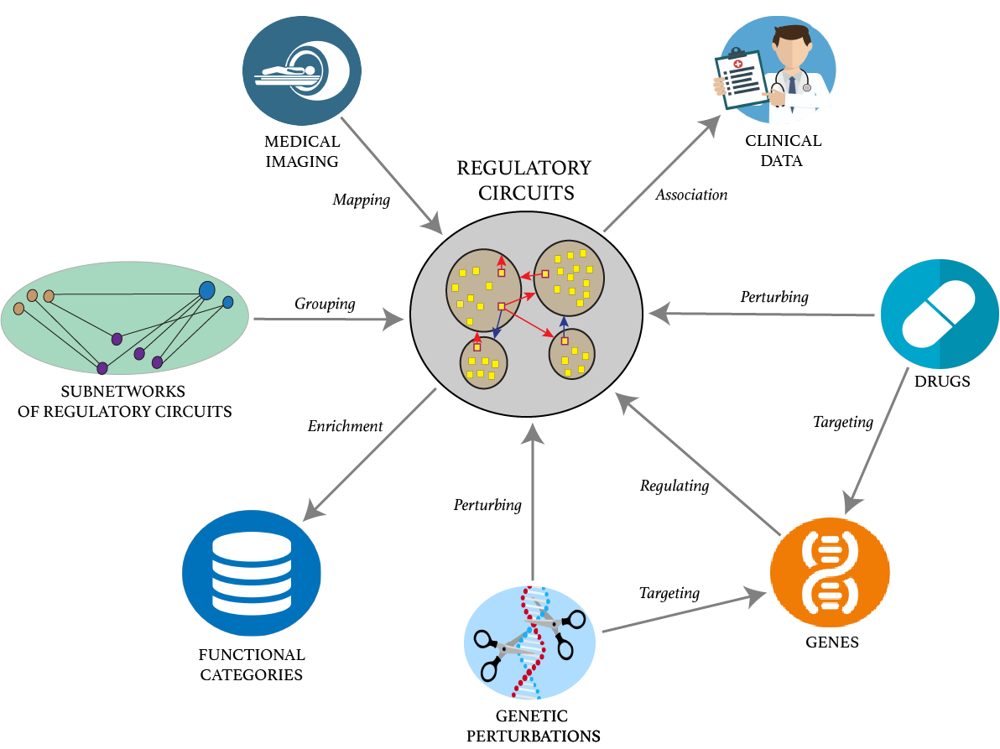

 

AMARETTO-Hub is a Knowledge Graph-based software platform that leverages neo4j and shiny to embed and interactively interrogate results generated by the *AMARETTO software toolbox which offers modular and complementary solutions to multimodal and multiscale network-based fusion of multi-omics, clinical, imaging, and perturbation data across studies of patients, etiologies and model systems of cancer.

**GitHub**:
[https://github.com/broadinstitute/AMARETTO-Hub](https://github.com/broadinstitute/AMARETTO-Hub)

AMARETTO-Hub provides users with neo4j-embedded shiny interactive representation and querying tools that redirect users to *AMARETTO-generated HTML reports.

(1) The AMARETTO algorithm learns networks of regulatory circuits - circuits of drivers and their target genes - from functional genomics or multi-omics data and associates these circuits to clinical, molecular and imaging-derived phenotypes within each biological system (e.g., model systems or patients).

(2) The Community-AMARETTO algorithm learns subnetworks of regulatory circuits that are shared or distinct across networks derived from multiple biological systems (e.g., model systems and patients, cohorts and individuals, diseases and etiologies, in vitro and in vivo systems)

(3) The Imaging-AMARETTO algorithm maps radiography and histopathology imaging data onto the patient-derived multi-omics networks for imaging diagnostics and prognostics to identify clinically relevant imaging biomarkers and decipher their underlying molecular mechanisms.

(4) The AMARETTO-Hub platform for Knowledge Graph-based embedding of knowledge learned via multimodal and multiscale network-based data fusion in previous steps. In these complex graphs, nodes and edges represent the diverse range of biomedical entities and the relationships between them, respectively. Graph-based embedding enables querying these complex graph-structured representations in a more sophisticated, efficient and user-friendly manner than can otherwise be accomplished by table representations alone.

 

<table>
<tbody>
<tr>
  <td style = "width: 100%; text-align: center">
    
  </td>
</tr>
</tbody>
</table>

 

# References

 

1. Gevaert, O., Nabian, M., Bakr, S., Everaert, C., Shinde, J., **Manukyan, A.**, ... & Pochet, N. (2020). Imaging-AMARETTO: an imaging genomics software tool to interrogate multiomics networks for relevance to radiography and histopathology imaging biomarkers of clinical outcomes. JCO clinical cancer informatics, 4, 421-435.. URL: [https://ascopubs.org/doi/full/10.1200/CCI.19.00125](https://ascopubs.org/doi/full/10.1200/CCI.19.00125)

2. Champion, M., Brennan, K., Croonenborghs, T., Gentles, A. J., Pochet, N., & Gevaert, O. (2018). Module analysis captures pancancer genetically and epigenetically deregulated cancer driver genes for smoking and antiviral response. EBioMedicine, 27, 156-166. URL: [https://www.sciencedirect.com/science/article/pii/S2352396417304723](https://www.sciencedirect.com/science/article/pii/S2352396417304723)

