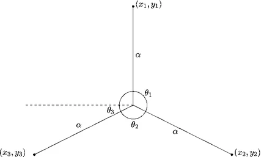
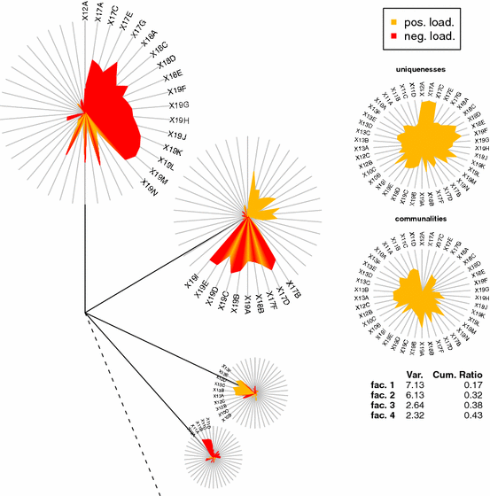

<!-- MathJax -->

 

Given a **data matrix** of \(X\) with \(n\) samples and \(p\) features, a general formulation of a R-mode EFA with \(k < p\) number of factors extracted is:
$$X_{nxp}=F_{nxk}A^T_{kxp}+E_{nxp}$$
where \(E\) is the error term, \(F\) is the factor score matrix and \(A\) is the factor loading matrix. **Dandelion Plot** visualizes EFA models which allows the simultaneous visualization of 

  * the **Explained Variance** and
  * the **Factor Loadings \(A\)**
  
where we emphasize the importance of each individual variable associated with their factors. Our visualization method have been employed in several clinical settings covering [eating disorders](https://link.springer.com/article/10.1186/s40337-023-00757-4), and [image-based tumor phenotyping](https://ejnmmires.springeropen.com/articles/10.1186/s13550-020-00686-2). We have made Dandelion plot publicly accesible using the R package [DandEFA](https://cran.r-project.org/web/packages/DandEFA/index.html).

**People**: [Erhan Cene](https://scholar.google.com/citations?hl=de&user=o7F1mWAAAAAJ&view_op=list_works&sortby=pubdate), [Ahmet Sedef](https://www.linkedin.com/in/ahmet-sedef-6129291a/), [Ibrahim Demir](https://www.linkedin.com/in/ahmet-sedef-6129291a/)

 

<table>
<tbody>
<tr>
  <th style = "width: 40%">
    Visualization of Explained Variance
  </th>
  <th style = "width: 40%">
    Dandelion Plot
  </th>
</tr>
<tr>
  <td style = "width: 40%; text-align: center">
    
  </td>
  <td style = "width: 40%; text-align: center">
    
  </td>
</tr>
</tbody>
</table>
 

# References

 

1. **Manukyan, A.**, Çene, E., Sedef, A., & Demir, I. (2014). Dandelion plot: a method for the visualization of R-mode exploratory factor analyses. Computational Statistics, 29, 1769-1791. URL: [https://link.springer.com/article/10.1007/s00180-014-0518-x](https://link.springer.com/article/10.1007/s00180-014-0518-x)

2. Martens, R. M., Koopman, T., Noij, D. P., Pfaehler, E., Übelhör, C., Sharma, S., ... & Boellaard, R. (2020). Predictive value of quantitative 18F-FDG-PET radiomics analysis in patients with head and neck squamous cell carcinoma. EJNMMI research, 10(1), 1-15. URL: [https://ejnmmires.springeropen.com/articles/10.1186/s13550-020-00686-2](https://ejnmmires.springeropen.com/articles/10.1186/s13550-020-00686-2)

3. Laskowski, N. M., Halbeisen, G., Braks, K., Huber, T. J., & Paslakis, G. (2023). Factor structure of the Eating Disorder Examination-Questionnaire (EDE-Q) in adult men with eating disorders. Journal of Eating Disorders, 11(1), 34. URL: [https://link.springer.com/article/10.1186/s40337-023-00757-4](https://link.springer.com/article/10.1186/s40337-023-00757-4)
