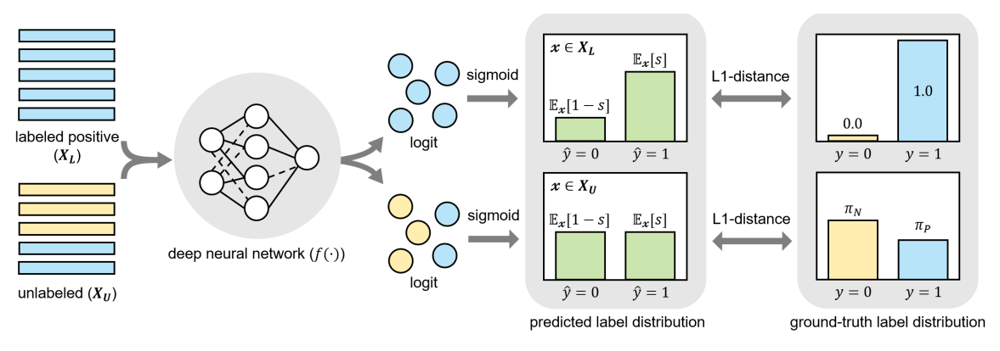

# Genomics and Epigenomics

## ChIP-seq phantom peaks

[Chromatin immunoprecipitation followed by sequencing (ChIP-seq)](https://doi.org/10.1038/nmeth.f.247) is a widely-used technique to map where
DNA-binding proteins attach to the genome. Big projects and databases like ENCODE and modENCODE have used this method
to identify binding sites for hundreds of proteins across different species. With all the data collected,
 it’s clear that some parts of the genome have unsually high frequency of protein-DNA interactions.
 These areas, known as high-occupancy target (HOT) regions, have been found in multiple species.
 

  
 

 
 
 

[ChIP-seq phantom peaks](https://pmc.ncbi.nlm.nih.gov/articles/PMC4538825/) or as we called them
[High-occupancy target (HOT) regions](https://academic.oup.com/nar/article/47/11/5735/5494779) are parts of the genome that have an unusual amount of
transcription factor binding sites. These regions show up in various species and are thought to be biologically important because of the
high concentration of transcription factor binding. They also overlap with housekeeping gene promoters, and the related genes are
consistently expressed across many cell types. Despite these interesting features, HOT regions are mainly defined using ChIP-seq
experiments and don't show the typical motifs for the transcription factors believed to bind there.
 
 

For us, the plausible explanations for motifless binding are a combination of 1) interaction of transcriptions factors (TFs) where only a handful
of them are actually binding to DNA 2) existence of weak binding sites where TFs bind to non-canonical motifs in a weak manner
3) regions with high-affinity for chromatin immunoprecipitation called ‘hyper-ChIPable’ regions.
 

  
 

Upon observing common low-level sequence features of HOT regions across species, we investigated whether potential technical biases in ChIP-seq could at least partially explain false positive signals on HOT regions.
14 out of 22 publicly available ChIP-seq experiments with knock-out of the genes that
encodes target proteins show enrichment even though the chipped protein shouldn't be
present in the analysed sample. Such false positive signal is the highest on HOT regions.
 
 
 
  
 
 
 

The observed ChIP signal arises from a combination of different signal sources.
The signal in a ChIP experiment originates from an antibody binding to the intended target protein (blue),
and nonspecific antibody binding—either to the non-target proteins (orange) or directly to polynucleotide structures,
such as R-loops (red). The error (orange + red) is not proportional to the signal from the targeted protein, rather,
it depends on sequence properties, antibody properties and expression characteristics of individual genomic regions.
The combination of different noise profiles result in a subset of ChIP-seq peaks being false positives.

 
  
 

 
 

For more details check out our:

* <strong>Publication</strong>: [Wreczycka et al, Nucleic Acids Research, Volume 47, Issue 11, 20 June 2019, Pages 5735–5745](https://doi.org/10.1093/nar/gkz460)
* <strong>Poster</strong>: <a href="hotregions.html">link</a>

 
 
 

## DNA methylation biomarkers derived from cell-free DNA

## DNA methylation landscape of neuroblastoma

# Target nomination

## Visualisations of biomarkers for patients with limited therapy options (clinical trials)

We developed a comprehensive set of visualizations, including oncoprints, t
o effectively highlight and emphasize key biomarkers in high medical need patients.
These visualizations offer a clear, intuitive understanding of the underlying genomic alterations,
facilitating the identification of potential therapeutic targets.
The analysis focuses on patients with diseases that have limited treatment options or poor outcomes derived from external databases of clnical trials,
denoted as a high medical need population. The visual representation may categorize patients based on
disease severity, unmet medical need, or current lack of effective therapies.

 

  
   

 

## Statistical analysis of selected biomarkers and patient populations

We performed comprehensive analysis of target nomination in the context of high medical need populations,
using survival analysis and other statistical emthods to illustrate the clinical significance of the nominated targets (genes).

 

  
   

 

## Target nomination using machine learning and deep learning methods

To rank molecules of interest for further investigation, we applied a method known as Positive and Unlabeled (PU) learning.
In this approach, we have information about which molecules are likely to be of high interest (positive samples),
but we lack information regarding the other molecules (i.e., no negative samples).
 

PU learning is a machine learning setting where the learner only has access to positive examples and unlabeled data.
The assumption is that the unlabeled data may contain both positive and negative examples. This approach has gained
increasing attention in the machine learning literature, as such data naturally arises in various applications,
including medical diagnosis and target nomination. For example, medical records typically list the diseases a
patient has been diagnosed with, but they rarely include information on diseases the patient does not have.
However, the absence of a diagnosis does not necessarily imply the absence of a disease. Patients may choose
not to seek medical care, and many conditions, such as diabetes, often go undiagnosed (Claesen et al. 2015b).
 

The goal of PU learning is the same as general binary classification: train a classifier that can distinguish between positive and negative examples based on the attributes.
However, during the learning phase, only some of the positive examples in the training data are labeled and none of the negative examples are, as illustrated below:
 

  
   

 

We applied PU classificators for molecules and their features of interest (gene expresion, mutations, available therapies, etc.) using:

* [Elkan-Noto classifier proposed by Elkan and Noto (2008)](https://cseweb.ucsd.edu/~elkan/posonly.pdf)
* [Bagging SVM method proposed by Mordelet and Vert (2013)](http://members.cbio.mines-paristech.fr/~jvert/svn/bibli/local/Mordelet2013bagging.pdf)
* [Pytorch implementation of Dist-PU (2022)](https://arxiv.org/pdf/2212.02801)

Dist-PU utilizes a neural network and approaches the problem through the lens of label distribution estimation,
aiming to model the probability distribution of both positive and negative labels within the unlabeled data.
The core idea behind Dist-PU is to learn the label distribution for both classes, enabling it to more effectively
handle scenarios where the labeled positive examples may not fully represent the entire positive class, as illustrated below:

 

  
   

 

