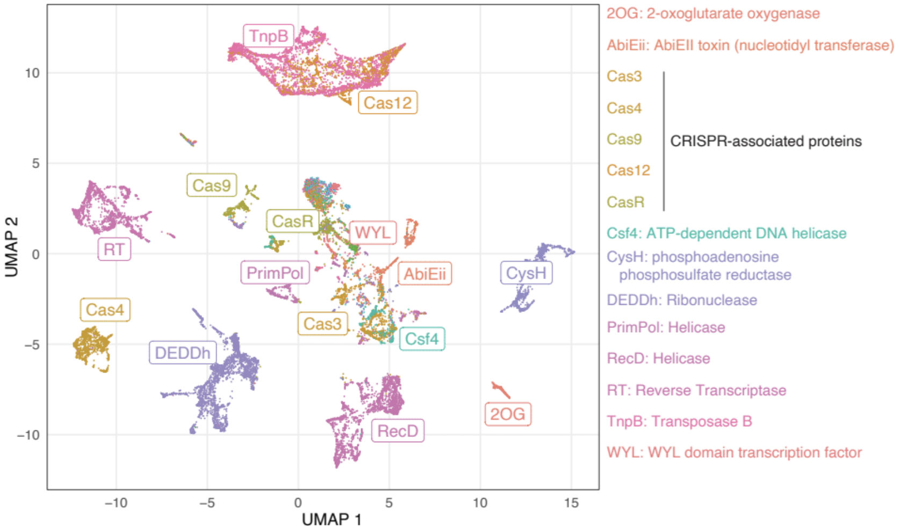
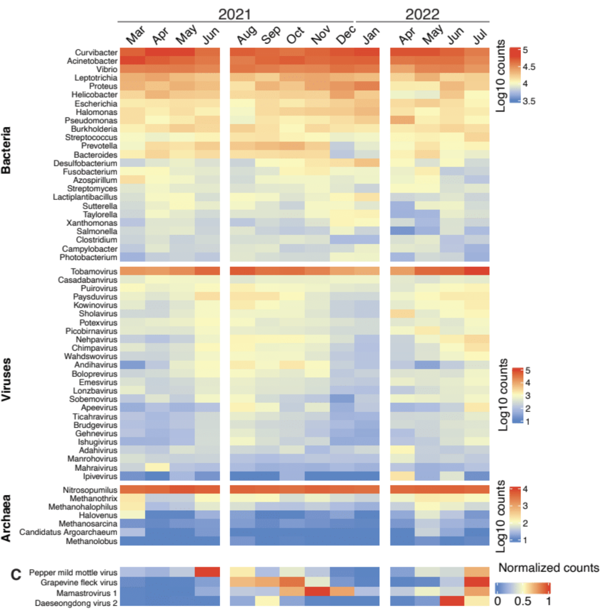
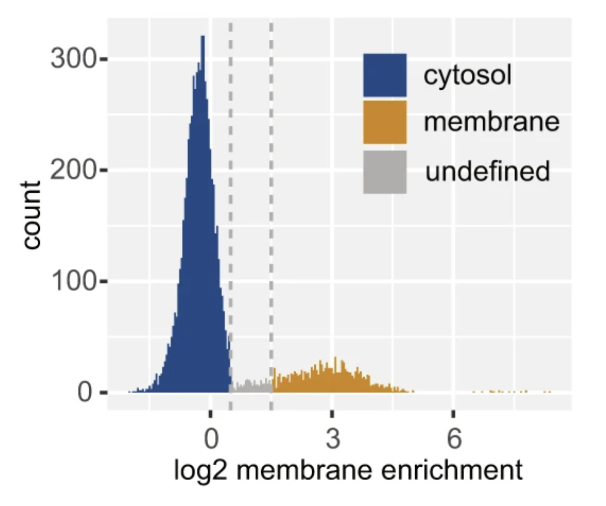
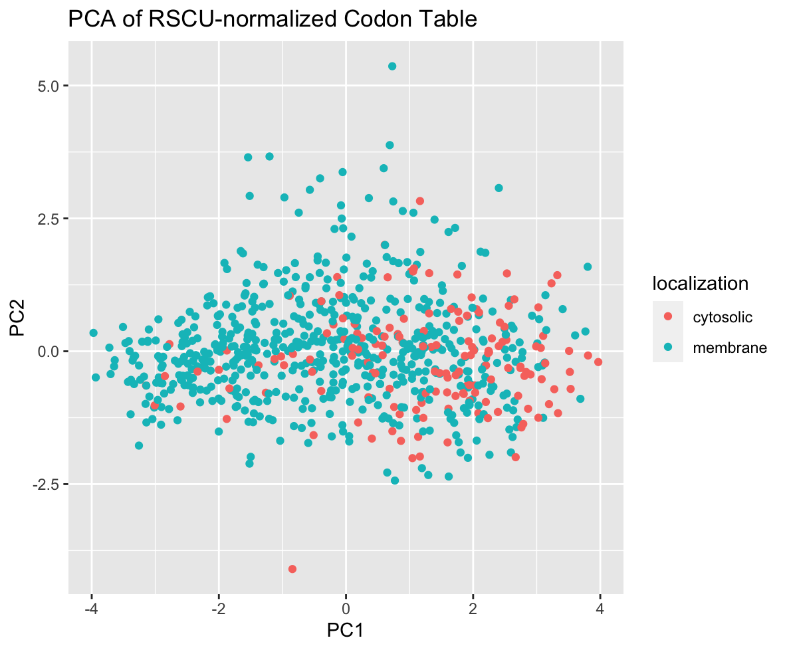
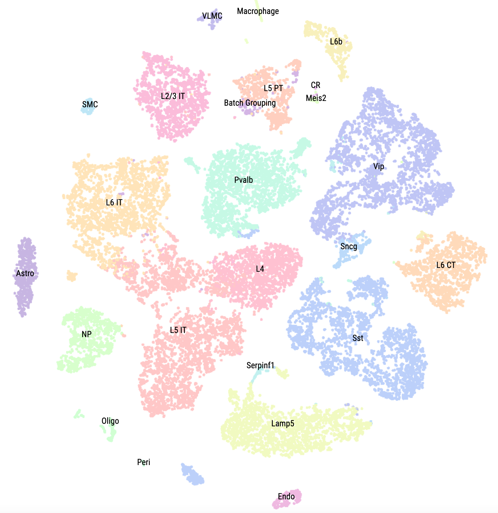
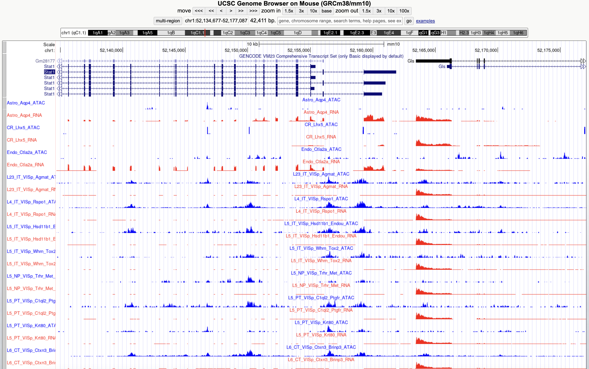
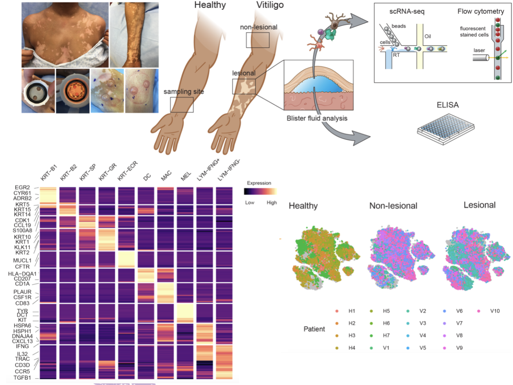

 

# Computational RNA Biology

## Wastewater Metagenomics

 
Emanuel Wyler, Markus Landthaler and I are developing computational pipelines for analyzing and monitoring wastewater data across Berlin and other environmental sites. See **Wastewater pipeline** [here](https://github.com/LandthalerLab/wastewater_virome).

We are trying to understand the taxonomic complexity of these comprehensive pools of organisms and RNA where we are aiming to discover new sequences (such as new variants of CRISPR-Cas proteins) within the wastewater to be used as novel substances for developing novel biotechnologies.

**Preprint**:
[Comprehensive profiling of wastewater viromes by genomic sequencing](https://www.biorxiv.org/content/10.1101/2022.12.16.520800v1)

 

<tr>
  <td></td>
  <td></td>
</tr>

 

## Codon Bias of mRNA

 
Markus Landthaler and I are investigating the Codon usage bias of mRNA associated with Endoplasmic Reticulum (ER). Specifically, we are interested in certain sites of mRNA that interacts with HDLBP, a RNA-binding protein that regulates the translation of mRNA around ER. Currently, we are investigating the codon usage of mRNA that are interacting with HDLBP, specifically pairs of codons that are abundantly used by these binding sites as well as their precise locations. See **CodonUtil package** [here](software.html). 

**Reference**:
[HDLBP binds ER-targeted mRNAs by multivalent interactions to promote protein synthesis of transmembrane and secreted proteins](https://github.com/LandthalerLab/CodonUtil)

 

<tr>
  <td></td>
  <td></td>
</tr>

 

# Single Cell Analysis

## Multiomic Brain Atlas

 This single cell brain atlas provides access to processed and analyzed data of human and mouse single cell (scRNA-Seq and scATAC-Seq) from large single cell multiomics studies conducted in Allen Institute for Brain Science as well as samples from additional projects such as FANTOM5 for CAGE-Seq. This integrative project has been conducted in collaboration with [https://www.umassmed.edu/gtc/about/faculty-publications/miguel-sena-esteves/](Sena-Esteves Lab) and  at UMass Chan Medical School. 

 In collaboration with Sena-Esteves Lab and Bioinformatics Core at UMass Chan Medical School, this website hosts a browser for interactively visualizing transcriptional profiles of mouse brain cell types, and two publicly accessible custom track hubs (for human and mouse) within UCSC genome browsers. 

**Website**:
[https://neocortex.dolphinnext.com/](https://neocortex.dolphinnext.com/)

**Single Cell Data (Cellxgene)**:
[https://neocortex.dolphinnext.com/cellxgenebrowser.html](https://neocortex.dolphinnext.com/cellxgenebrowser.html)

 

<tr>
  <td></td>
  <td></td>
</tr>

 

## Vitiligo Atlas

In collaboration with Garber Lab and Bioinformatics Core at UMass Chan Medical School, we provided access to the data we used in our recent publication ([Gellatly et. al 2021](https://www.science.org/doi/10.1126/scitranslmed.abd8995)) where we sought to identify cellular communications that show disruption in lesions or in non-lesional skins of individuals suffering from Vitiligo, an autoimmune skin disease characterized by the targeted destruction of melanocytes by T cells.

The data provided was obtained using our in-house [inDrop system](https://dx.doi.org/10.1016%2Fj.cell.2015.04.044) to generate single cell RNA-Seq profiles on affected and unaffected skin from vitiligo patients, as well as healthy controls. The data was analyzed using an end-to-end scRNA data analysis package called [SignallingSingleCell](https://github.com/garber-lab/SignallingSingleCell). 

All raw sequencing data was processed by the scRNA-Seq inDrop pipeline developed within the interactive pipeline manager DolphinNext ([Yukselen et. al 2020](https://bmcgenomics.biomedcentral.com/articles/10.1186/s12864-020-6714-x)). 

**Website**:
[https://vitiligo.dolphinnext.com/](https://vitiligo.dolphinnext.com/)

**Single Cell Data (Cellxgene)**:
[https://vitiligo.dolphinnext.com/browse.html](https://vitiligo.dolphinnext.com/browse.html)

 

<tr>
  <td></td>
  <td></td>
</tr>

 

<!-- # Stevens-Johnsons Syndrome (SJS) -->

<!-- In high throughput sequencing era, genetic information is complex, chaotic and often incomprehensible. To this end, Bioinformatics has evolved to analyze and summarize massive sequencing data sets, and data scientific methods have been developed to investigate biological systems and cellular dynamics by using these large volumes of processed omics data.  -->

<!-- Across many projects, I have designed software platforms to generate information from such large sets of data in order to find similarities across countless datasets and to build network models to interrogate databases against each other to help biological scientists to build hypothesis. -->

<!-- Currently, we are developing additinal software tools to analyze spatial transcriptomics datasets and to infer spatial information of cellular systems.  -->
