# Genomics and Epigenomics

## ChIP-seq phantom peaks

[Chromatin immunoprecipitation followed by sequencing (ChIP-seq)](https://doi.org/10.1038/nmeth.f.247) is a widely used
technique to map DNA-binding proteins and their interactions across the genome. Major projects like ENCODE and modENCODE
have utilized ChIP-seq to identify binding sites for hundreds of proteins across various species.

Through these large-scale studies, researchers have identified certain regions of the genome with an unusually
high frequency of protein-DNA interactions. Known as high-occupancy target (HOT) regions, these areas have been
consistently observed across multiple species and are believed to either play a biologically significant role or
represent technical artifacts of the ChIP-seq protocol.

### What Are ChIP-seq Phantom Peaks or HOT Regions?

[HOT regions](https://academic.oup.com/nar/article/47/11/5735/5494779), also referred to as [ChIP-seq phantom peaks](https://pmc.ncbi.nlm.nih.gov/articles/PMC4538825/),
are genomic areas with an abnormally high number of transcription factor binding sites.
These regions are enriched in housekeeping gene promoters, and their associated genes are consistently expressed across many cell types.

Despite their intriguing features, HOT regions are primarily defined through ChIP-seq data and often lack the characteristic motifs of
the transcription factors that seem to bind there. This raises questions about the underlying mechanisms responsible for their formation.

 
 
 

 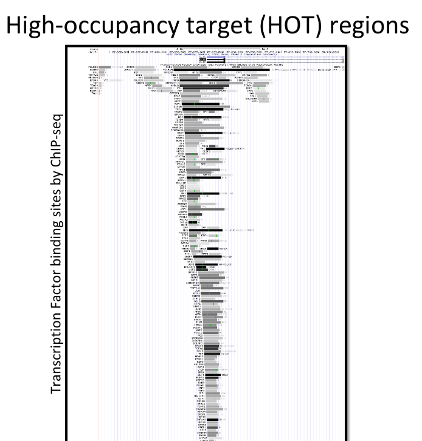 

 
 
 

### Possible Explanations for Motifless Binding in HOT Regions

Several hypotheses might explain the unique nature of these regions:

* <strong>Protein-Protein Interactions</strong>: Only a subset of transcription factors (TFs) directly binds to DNA, while others associate indirectly through interactions with these TFs.
* <strong>Weak Binding Sites</strong>: Some TFs may bind to non-canonical motifs with low affinity.
* <strong>Hyper-ChIPable Regions</strong>: These regions may exhibit an inherent high affinity for ChIP due to specific chromatin properties.

 
 
 

 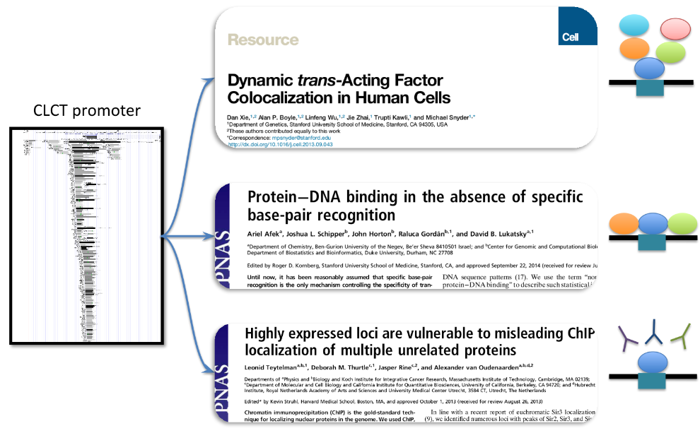 

 
 
 

### Uncovering Technical Bias in ChIP-seq Data

To investigate whether technical biases in ChIP-seq could explain the false-positive signals observed in HOT regions,
we analyzed 22 publicly available ChIP-seq datasets. Remarkably, 14 of these datasets included knockouts of the target protein’s gene.
Even in these samples, significant signal enrichment was observed at HOT regions, suggesting that
these signals are not due to genuine binding of the target protein.

 
 
 

 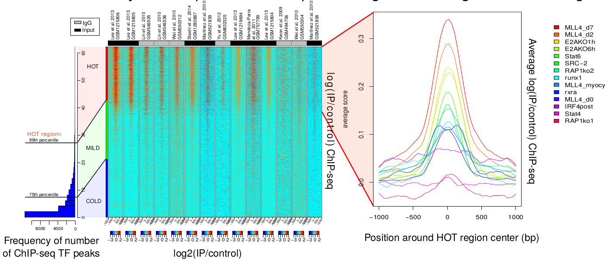 

 
 
 

### The Source of ChIP-seq Signal

The signal in ChIP-seq experiments arises from a mix of sources:

* <strong>True signal</strong>: Antibody binding to the target protein (blue).
* <strong>Nonspecific signal</strong>: Antibody binding to non-target proteins (orange) or directly to polynucleotide structures like R-loops (red).

The proportion of nonspecific signal varies depending on the antibody's properties, the genomic sequence features, and expression characteristics. This variation leads to false-positive peaks in ChIP-seq data, particularly in HOT regions.

 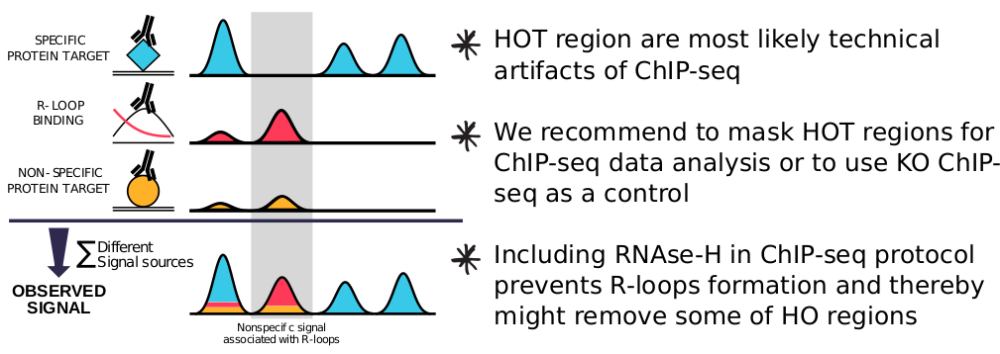 

 
 
For more details check out our:

* <strong>Publication</strong>: [Wreczycka et al, Nucleic Acids Research, Volume 47, Issue 11, 20 June 2019, Pages 5735–5745](https://doi.org/10.1093/nar/gkz460)
* <strong>Poster</strong>: <a href="hotregions.html">link</a>

 
 
 

## DNA methylation biomarkers derived from cell-free DNA

 

I have a keen interest in analyzing DNA methylation in cell-free DNA (cfDNA),
a focus I have explored through projects on acute coronary syndrome (using blood cfDNA) and neuroblastoma (using urine cfDNA and solid tumor samples).

[Cell-free DNA (cfDNA)](https://doi.org/10.1038/s41467-024-46435-0) has emerged as a powerful biomarker for non-invasive cancer screening, diagnosis, treatment, and monitoring.
DNA methylation changes, which occur early in tumorigenesis and are widespread, make [cfDNA methylation](https://doi.org/10.1038/s41586-022-05580-6) an especially attractive target for biomarker discovery.

 
 
 

  

Figure copied from: [Cell-free nucleic acids as biomarkers in cancer patients](https://doi.org/10.1038/nrc3066).
 
 
 

Mutations, methylation patterns, DNA integrity, microsatellite alterations, and viral DNA can all be detected in cfDNA from blood samples.
Tumor-derived cfDNA, released by tumor cells, circulates in various forms and levels in the bloodstreams of cancer patients.

We have applied computational approaches to accurately deconvolute the relative fractions of diverse cell types contributing to circulating cfDNA (ccfDNA):

 
 
 

 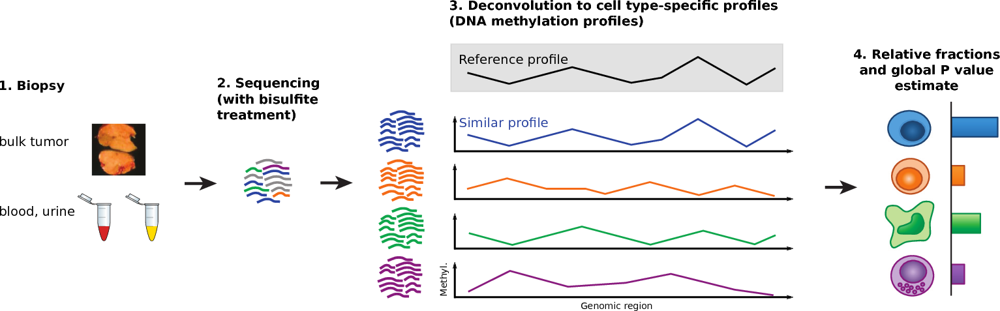 

Figure adapted from [Newman et al Nature Methods 2015](https://doi.org/10.1038/nmeth.3337).
 
 
 

### DNA Methylation Biomarkers in Acute Coronary Syndrome (cfDNA in Blood)

We proposed circulating cfDNA (ccfDNA) methylation as a non-invasive marker for acute coronary syndrome (ACS), as damaged tissues release DNA into the bloodstream.

Our research utilized ccfDNA methylation profiles to:

* Differentiate between ACS subtypes.
* Leverage the cell type specificity of DNA methylation to deconvolute cfDNA origins and identify methylation-based biomarkers for patient stratification.

We identified hundreds of methylation markers associated with ACS types, many of which were linked to genes involved in cardiovascular conditions and inflammation. These findings were validated in an independent cohort, demonstrating the potential of ccfDNA methylation for diagnosing acute coronary events. Our methods are also applicable to chronic cardiovascular diseases.

For more details check out our:

* <strong>Publication</strong>: [Rafael R C Cuadrat et al, NAR Genom Bioinform . 2023 Jun 28;5(2)](https://doi.org/10.1093/nargab/lqad061)
 
 

### DNA Methylation Landscape in Neuroblastoma (Primary Tissues and Urine cfDNA)

DNA methylation plays critical roles in cancer by altering gene regulation and contributing to disease states. Neuroblastoma,
a pediatric cancer arising from neural crest cells, exhibits a wide clinical spectrum, ranging from spontaneously regressing tumors
to highly aggressive forms. While genetic alterations explain part of this variability, epigenetic factors such as DNA methylation are
believed to play a key role in neuroblastoma pathogenesis.

In collaboration with Prof. Dr. med. Johannes H. Schulte (Charité Hospital, Berlin), we investigated DNA methylation at single-nucleotide
and genome-wide scales in primary neuroblastoma samples. Using whole-genome bisulfite sequencing (Bisulfite-seq) and RNA-seq data, we:

* Confirmed methylation-based clustering patterns distinguishing high-risk from low-risk tumors and MYCN-amplified from non-MYCN-amplified tumors.
* Identified MYCN-driven methylation deregulation in regulatory elements of MYCN-amplified cases.
* Combined Bisulfite-seq, RNA-seq, tumor-specific H3K27ac ChIP-seq data, and DNA motifs to model transcription factor networks deregulated in high-risk neuroblastomas.

 
 
 

 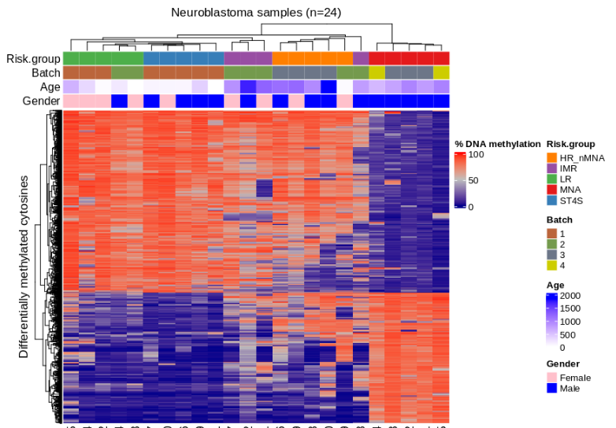 

Figure: Hierarchical clustering of differentially methylated CpGs among 24 neuroblastoma patients. Columns represent patients; rows represent CpGs. DNA methylation percentages are normalized to a [0,1] range. Patient-specific attributes, including risk group, sequencing batch, age, and gender, are indicated.
 
 
 

Our findings suggest that specific transcription factor networks, disrupted by DNA methylation alterations, contribute to the regulatory dysfunctions underlying high-risk neuroblastoma. These epigenetic features may serve as valuable targets for future research and therapeutic intervention.

We validated these findings in cfDNA derived from urine in collaboration with the AG Deubzer lab (Charité Hospital, Berlin).

 
 
 

 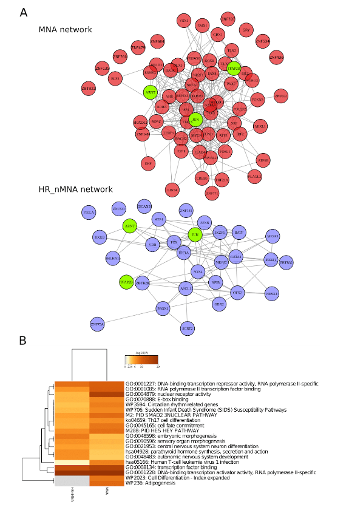 

Figure: (A) Regulatory protein-protein interaction (PPI) networks based on motif activity results for MYCN-amplified tumors (red) and high-risk, non-MYCN-amplified tumors (blue). Transcription factors common to both networks are shown in green.
(B) Top 20 Gene Ontology terms from Metascape analysis, highlighting pathways enriched in MYCN-amplified and high-risk neuroblastoma networks.
 
 
 

# Target nomination

 

## Visualization and Statistical Analysis of Biomarkers in Patients with Limited Treatment Options

We developed a comprehensive suite of visualizations, including oncoprints, to effectively highlight and emphasize key biomarkers in patients with high medical needs. These visualizations provide clear, intuitive insights into genomic alterations, aiding in the identification of potential therapeutic targets.

Our analysis focuses on patients with diseases that have limited treatment options or poor outcomes, sourced from external databases of clinical trials, collectively referred to as the high medical need population. These visual representations categorize patients based on factors such as disease severity, unmet medical need, or the lack of effective therapies.

To support target nomination, we performed an in-depth analysis using survival analysis and other statistical methods to demonstrate the clinical relevance of nominated targets (genes).

 
 
 
<figure class="half" style="display:flex">
    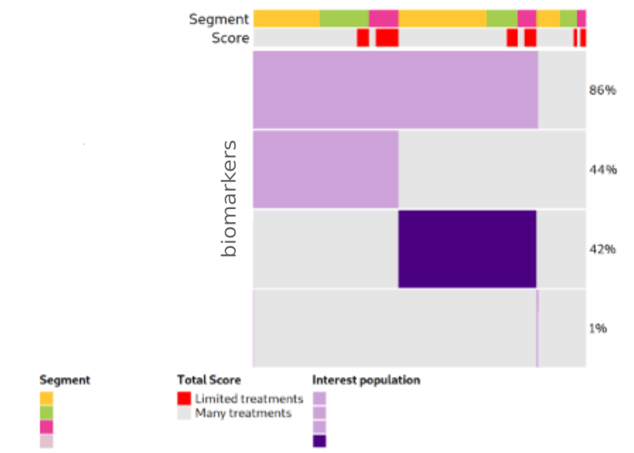
    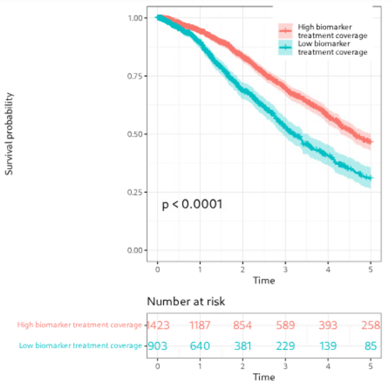
</figure>
 
<figcaption>Figure: Example of visualization and survival analysis of selected biomarkers.</figcaption>
 
 
 

## Identifying Novel Anticancer Targets Using Machine Learning and AI Methods

To prioritize molecules for further study, we employed Positive and Unlabeled (PU) learning, a machine learning framework tailored for cases where only positive examples are explicitly labeled, and negative examples are unknown.

PU learning is particularly effective in scenarios where data naturally arises in this format, such as medical diagnoses or target identification. For example, medical records often document diagnosed conditions (positive examples) but do not explicitly record the absence of conditions (negative examples). This framework assumes that the unlabeled set may contain both positive and negative examples, allowing for more nuanced classification (Claesen et al. 2015b).

The goal of PU learning is similar to binary classification: train a model to distinguish between positive and negative examples based on attributes. However, during training, only a subset of the positive examples is labeled, and no explicit negative examples are provided. This process is illustrated below:

 
 
 

  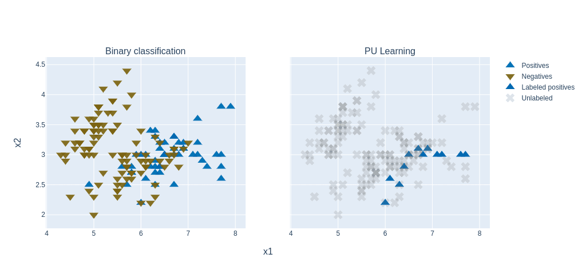
Figure adapted from [a blog post.](https://techblog.ing.pl/blog/podstawy-positive-unlabeled-learning)

 
 
 

We applied PU classifiers to analyze molecules and their features of interest, such as gene expression, gene mutations, and available therapies, using:

* [Elkan-Noto classifier (Elkan and Noto, 2008)](https://cseweb.ucsd.edu/~elkan/posonly.pdf)
* [Bagging SVM method (Mordelet and Vert, 2013)](http://members.cbio.mines-paristech.fr/~jvert/svn/bibli/local/Mordelet2013bagging.pdf)

Additionally, we used an unsupervised approach with autoencoders (in pytorch) to identify the most predictive features within groups of molecules of interest.
 
 
 
 

  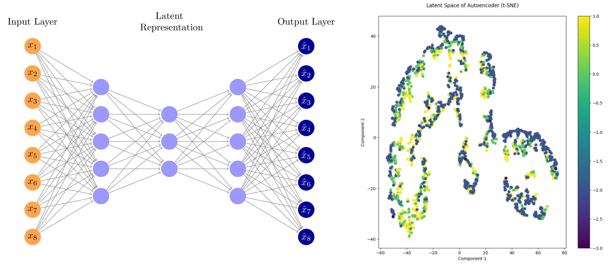
 Figure: (A) Schematic representation of an autoencoder. (B) Example visualization of a latent space in 2D using t-SNE.

 
 
 
 

