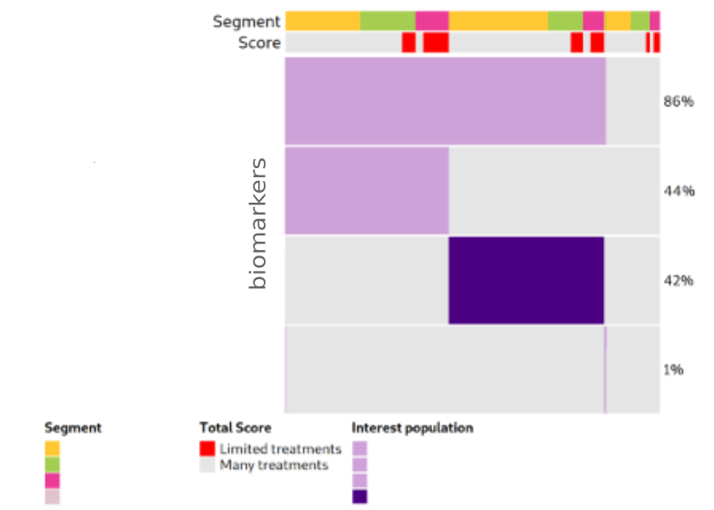

Here’s a glimpse of my portfolio.

<ol class="toc-list">
  <li>
    <a href="#research">Research</a>
    <ol>
      <li><a href="#genomics">Bias interpretation in genomics</a></li>
      <li><a href="#cfDNA">Liquid biopsy epigenetics in disease</a></li>
    </ol>
  </li>
  <li><a href="#opensource">Open source software</a></li>
  <li><a href="#freelance">Freelance</a>
    <ol>
      <li><a href="#target">Prioritization of therapeutic targets in clinical trials</a></li>
      <li><a href="#igv">Web app feature development</a></li>
    </ol>
  </li>
  <li><a href="#sideprojects">Side projects</a></li>
</ol>

<!--   -->
<!-- Research -->
<!--   -->

<h2 id="research">Research</h2>

<!-- Bias detection and interpretation in genomics experiment -->

<strong>Bias interpretation in genomics</strong>

  We used machine learning models - elastic net regression and principal component analysis (PCA)-
  to investigate genomic regions called 'HOT regions' 
  which appear to attract unusually high numbers of proteins and 
  are likely 
  <a href="https://pmc.ncbi.nlm.nih.gov/articles/PMC4538825/" target="_blank">technical artifacts</a>
  of chromatin immunoprecipitation followed by sequencing 
  (<a href="https://www.nature.com/articles/nrg2641" target="_blank">ChIP-seq</a>) experiments.

  While factors like antibody quality and chromatin interactions are known to affect ChIP-seq reliability, 
  our study revealed that GC- and CpG-rich sequences, 
  <a href="https://www.nature.com/articles/npp2012112" target="_blank">DNA methylation</a>,
   and RNA:DNA hybrids 
  (<a href="https://www.nature.com/articles/s41580-022-00474-x" target="_blank">R-loops</a>)
   also contribute to these artifacts across species. This work shows how machine learning can uncover hidden biases in 
   genomic data and improve experimental interpretation.

  <figure style="text-align: center; max-width: 700px; margin: 0 auto;">
    
  
    <figcaption class="mytext" style="text-align: center; font-family: 'Georgia', serif; font-size: 14px; color: #555; margin-top: 10px;">
      Figure: Unexpected ChIP-seq signals appear in HOT regions even without the target protein (KO ChIP-seq). 
      The barplot shows how often these regions are detected as bound - 
      HOT regions correspond to the top 1% of genomic regions with the highest protein binding signals (99th percentile).

    </figcaption>
  </figure>

  

    <a href="https://doi.org/10.1093/nar/gkv681" target="_blank">
      Publication: Wreczycka K et al, Nucleic Acids Research, 2019
    </a>
  

  

<!-- cfDNA methylation biomarkers in acute coronary syndrome -->

<strong>Liquid biopsy epigenetics in disease</strong>

<strong>DNA methylation biomarkers in acute coronary syndrome (blood-derived cfDNA)</strong>

  We explored circulating cell-free DNA (<a href="https://doi.org/10.1038/s41571-020-00457-x" target="_blank">cfDNA</a>) methylation 
  as a non-invasive biomarker for acute coronary syndrome (ACS),
  based on the principle that damaged tissues release DNA into the bloodstream.

  Using cfDNA methylation profiles, we differentiated ACS subtypes and identified cell type-specific DNA methylation
  markers to trace the origin of cfDNA. Hundreds of methylation markers linked to cardiovascular conditions and inflammation 
  were identified and validated in an independent cohort, highlighting the potential of cfDNA methylation for ACS diagnosis.

  <figure style="text-align: center; max-width: 700px; margin: 0 auto;">
    
  
    <figcaption class="mytext" style="text-align: center; font-family: 'Georgia', serif; font-size: 14px; color: #555; margin-top: 10px;">
      Figure: PCA of 254 differentially methylated regions linked to ACS severity using linear models.
    </figcaption>
  </figure>

  <a href="https://doi.org/10.1093/nargab/lqad061" target="_blank">
  Publication: Rafael R C Cuadrat et al, NAR Genomics and Bioinformatics, 2023
  </a>

<!-- DNA methylation in neuroblastoma -->

<strong>DNA methylation profiling in neuroblastoma (solid tissues and urine-derived cfDNA)</strong>

  Neuroblastoma is a pediatric cancer ranging from mild to aggressive forms. While genetic changes explain some variability, 
  we showed that DNA methylation plays a key role in its progression. 
  In collaboration with Charité Hospital (Berlin), we analyzed primary tumor tissues and urine cfDNA 
  using bisulfite-seq and RNA-seq, identifying methylation patterns 
  distinguishing high- and low-risk tumors. We also linked MYCN-driven 
  methylation changes to disrupted transcription factor networks, highlighting potential targets for therapies.

  

  Figure: Methylation-based clustering of neuroblastoma patients using differentially methylated CpGs.

<!-- 

  

  Figure: (A) Regulatory networks based on motif activity in MYCN-amplified and high-risk tumors. 
  (B) Enriched gene pathways including transcription factors binding to E-box DNA motifs.

-->

<!--   -->
<!-- Open source software -->
<!--   -->

<h2 id="opensource">Open source software</h2>

<!-- Genomation-->

  

  

    
<em>genomation</em> – a Bioconductor R package designed to simplify genomic feature and interval analysis. It includes functions for reading BED/GFF files as GRanges, summarizing features over regions, creating enrichment plots or heatmaps, and annotating regions with exons, introns, or promoters.

  

  <a href="https://github.com/BIMSBbioinfo/genomation" target="_blank">https://github.com/BIMSBbioinfo/genomation</a>,
  developed in the team of Dr. Altuna Akalin at Bioinformatics and Omics Data Science Platform at 
<a href="https://www.mdc-berlin.de/bioinformatics" target="_blank">MDC BIMSB.</a>

<!-- Pigx -->

  

  

    
<em>PiGx</em> – a collection of genomics pipelines implemented using Snakemake, Python, and R. Each pipeline is easily configured with a sample sheet and a simple settings file. PiGx generates comprehensive, interactive HTML reports that summarize key findings from your samples.

  

  <a href="https://github.com/BIMSBbioinfo/pigx" target="_blank">
    https://github.com/BIMSBbioinfo/pigx</a>,
  developed in the team of Dr. Altuna Akalin at Bioinformatics and Omics Data Science Platform at 
<a href="https://www.mdc-berlin.de/bioinformatics" target="_blank">MDC BIMSB.</a>

<!-- Motif activity -->

  

  

    
<em>motifActivity</em> – an R package for identifying key transcription factors (TFs) responsible for changes in gene expression or epigenetic marks across samples. It predicts TF activity profiles using input data from RNA-seq, BS-seq, ChIP-seq, ATAC-seq, and similar methods, combined with a set of DNA motifs.

  

  <a href="https://github.com/katwre/motifActivity" target="_blank">
    https://github.com/katwre/motifActivity</a>,
  developed in the team of Dr. Altuna Akalin at Bioinformatics and Omics Data Science Platform at 
<a href="https://www.mdc-berlin.de/bioinformatics" target="_blank">MDC BIMSB.</a>

<!--   -->
<!-- Freelance -->
<!--   -->

<!-- Prioritization of therapeutic targets in clinical trials  -->

<strong>4.1 Prioritization of therapeutic targets in clinical trials</strong>

<h3 class="mytext"><strong>Visualization and Statistical Analysis of Biomarkers</strong></h3>

We developed interactive visualizations, including oncoprints, to highlight key biomarkers in patients with limited treatment options. These visual summaries help uncover genomic alterations and support identifying new therapeutic targets.

We focused on patients from clinical trial databases facing poor outcomes or lacking effective therapies. Our statistical analyses, including survival analysis, demonstrate the clinical relevance of nominated targets.

  
  

Figure: Example of biomarker visualization and survival analysis.

<h3 class="mytext"><strong>Machine learning for target identification</strong></h3>

To prioritize therapeutic targets, we applied <a href="https://cseweb.ucsd.edu/~elkan/posonly.pdf" target="_blank">Positive and Unlabeled (PU) learning</a>, ideal for cases where only confirmed targets are known. PU classifiers helped distinguish potential targets using gene expression, mutations, and therapy annotations.

  

Figure: PU learning principle (figure adapted from <a href="https://techblog.ing.pl/blog/podstawy-positive-unlabeled-learning" target="_blank">a blogpost</a>).

  Additionally, we used autoencoders (PyTorch) to uncover hidden patterns and prioritize key molecular features in an unsupervised way.
  

  

Figure: Autoencoder workflow and latent space visualization using t-SNE.

<!-- 5.2 Web app feature development  -->

<strong>4.2 Web app feature development</strong>

  I contributed to enhancing the 
  <a href="https://igv.org/app/" target="_blank">IGV web application</a>, 
  an interactive tool for visual exploration of genomic data 
  (<a href="https://github.com/igvteam/igv-webapp" target="_blank">source code</a>).
  Built with JavaScript and Python, this tool allows visualization of both public and in-house datasets.
  

  
  <ul class="mytext" style="list-style-type: disc; margin-left: 110px;">
    <li>Enabled dynamic visualization of new in-house genomic datasets.</li>
    <li>Added highlighting of genomic regions of interest (e.g., genetic variants).</li>
    <li>Developed new display options for RefSeq and GENCODE annotations:
      <ul>
        <li>Collapse/expand all transcript isoforms.</li>
        <li>Extend selected gene isoforms for detailed view.</li>
        <li>Added controls to adjust track widths for optimal display.</li>
      </ul>
    </li>
    <li>Linked visualized tracks to their source databases.</li>
    <li>Implemented command-line tool for automated snapshots of defined genes or regions.</li>
  </ul>
  
  
  

    
    

      Figure: Example IGV web app view showing genomic data tracks.
    

  

<!--   -->
<!-- Side projects -->
<!--   -->

<h2 id="sideprojects">Side projects</h2>

<!-- Protein Folding -->

  <em>Protein Folding in the HP Model</em> - implementation of simulated annealing and replica exchange Monte Carlo algorithm for protein folding in the HP model in Python and NumPy. The HP model simplifies protein folding by using hydrophobic (H) and polar (P) amino acids on a square lattice. Metropolis–Hastings algorithm enables sampling protein configurations based on the Boltzmann distribution.

  
  
Figure: Lattice HP model showing global energy.

<a href="https://github.com/katwre/bioinformatics-projects/tree/master/Molecular_Dynamics" target="_blank">https://github.com/katwre/bioinformatics-projects/tree/master/Molecular_Dynamics</a>

<!-- Genome Assembly -->

  

  

    <em>Genome Assembly Using de Bruijn Graph</em> - implementation of de Bruijn graph-based genome assembly with Eulerian walk to reconstruct DNA sequences from k-mers. Includes short-read assembly principles based on publications by Compeau et al. (2011) and Pevzner et al. (2001)
  

  

  

  
  
Figure: De Bruijn graph.

<a href="https://github.com/katwre/bioinformatics-projects/tree/master/genome_assembly" target="_blank">https://github.com/katwre/bioinformatics-projects/tree/master/genome_assembly</a>

<!-- Sudoku -->

  

  

    <em>Sudoku</em> - a simple Sudoku game implemented in JavaScript and JQuery. 

  

  

  

<a href="https://github.com/katwre/sudoku" target="_blank">https://github.com/katwre/sudoku</a>

<!-- Minesweeper -->

  

  

    <em>Minesweeper</em> - classic Minesweeper game implemented in Java using SWING and AWT libraries. 

  

  

  

<a href="https://github.com/katwre/Minesweeper" target="_blank">https://github.com/katwre/Minesweeper</a>

<!-- Django Web-Services -->

<strong>Django-Based Web Services</strong>

Django-based server for Multiple Sequence Alignment (MSA) visualization - <a href="https://github.com/freesci/MSA-vis-project" target="_blank">https://github.com/freesci/MSA-vis-project</a>

Mobile application using Django, manifesto app, and localStorage - <a href="https://github.com/katwre/phone_application" target="_blank">https://github.com/katwre/phone_application</a>

<!-- Discover Career Match -->

<strong>Discover Your Career Match</strong>

Interactive tool that matches careers to users based on their personality profile (Big Five personality traits). Runs directly in the browser via Pyodide.

  
  
Figure: PCA plot showing career matches based on personality profile.

  <a href="https://github.com/katwre/Personalities" target="_blank">https://github.com/katwre/Personalities</a>
  

