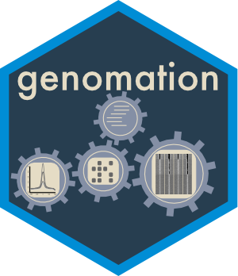
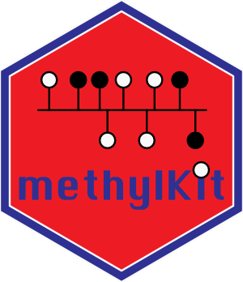
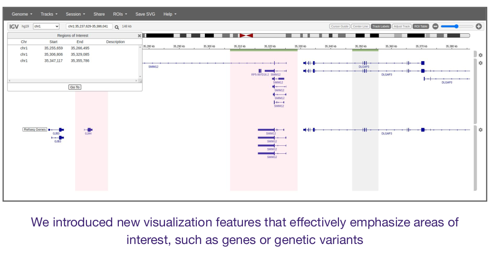
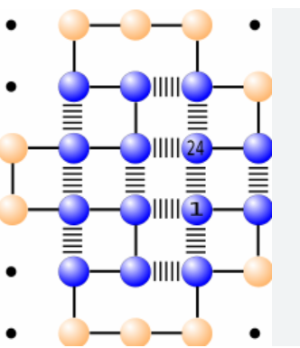
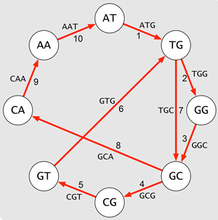
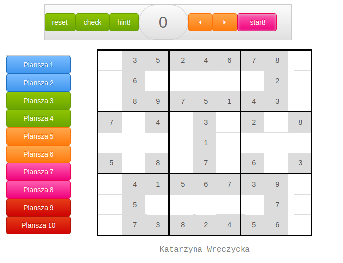

 

# Open source software

### Genomation

 
  
 

Genomation is a Bioc R package that provides collection of functions for simplfiying common tasks in genomic feature/interval analysis. It provides functions for reading BED and GFF files as GRanges objects, summarizing genomic features over predefined windows so users can make average enrichment of features over defined regions or produce heatmaps. It can also annotate given regions with other genomic features such as exons,introns and promoters.

**People**: [Altuna Akaling](hhttps://www.mdc-berlin.de/bioinformatics), [Vedran Franke](https://www.mdc-berlin.de/bioinformatics) and others

**GitHub**:
[https://github.com/BIMSBbioinfo/genomation](https://github.com/BIMSBbioinfo/genomation)

**Publication**:
[Akalin A, Franke V, Vlahovicek K, Mason C, Schubeler D (2014). “genomation: a toolkit to summarize, annotate and visualize genomic intervals.” Bioinformatics](https://academic.oup.com/bioinformatics/article/31/7/1127/181034)
 

### MethylKit

 
  
 

methylKit is a Bioc R package for DNA methylation analysis and annotation from high-throughput bisulfite sequencing. The package is designed to deal with sequencing data from RRBS and its variants, but also target-capture methods such as Agilent SureSelect methyl-seq. In addition, methylKit can deal with base-pair resolution data for 5hmC obtained from Tab-seq or oxBS-seq. It can also handle whole-genome bisulfite sequencing data if proper input format is provided.

**People**: [Altuna Akalin](https://www.mdc-berlin.de/bioinformatics), [Alex Blume](https://www.mdc-berlin.de/bioinformatics) and others

**GitHub**:
[https://github.com/al2na/methylKit](https://github.com/al2na/methylKit)

**Publication**:
[Akalin A, Kormaksson M, Li S, Garrett-Bakelman FE, Figueroa ME, Melnick A, Mason CE (2012). “methylKit: a comprehensive R package for the analysis of genome-wide DNA methylation profiles.” Genome Biology, 13(10), R87.](https://genomebiology.biomedcentral.com/articles/10.1186/gb-2012-13-10-r87)

 

### PiGx - Reproducible pipelines in genomics using GNU Guix

 
  
 

PiGx is a collection of genomics pipelines implemented in snakemake, Python and R. All pipelines are easily configured with a simple sample sheet and a descriptive settings file. The result is a set of comprehensive, interactive HTML reports with interesting findings about your samples.

**People**: [Altuna Akalin](https://www.mdc-berlin.de/bioinformatics), [Ricoardo Wurmus](https://www.mdc-berlin.de/bioinformatics) and others

**GitHub**:
[http://bioinformatics.mdc-berlin.de/pigx/](http://bioinformatics.mdc-berlin.de/pigx/)

**Publication**:
[Wurmus R, Uyar B, Osberg B, Franke V, Gosdschan A, Wreczycka K, Ronen J, Akalin A. PiGx: Reproducible genomics analysis pipelines with GNU Guix. Gigascience 2018](https://academic.oup.com/gigascience/article/7/12/giy123/5114263)

 

### MotifActivity

 
  
 

The motifActivity R package predicts key transcription factors (TFs) driving gene expression or epigenetic marks changes across the input samples, and the activity profiles of TFs. As input is uses a set of gene expression (e.g. RNA-seq) or epigenetic marks (such as from BS-seq, ChIP-seq, ATAC-seq etc.) across samples, and a set of DNA motifs.

**People**: [Katarzyna Wreczycka](hhttps://www.mdc-berlin.de/bioinformatics) under the supervision of [Altuna Akalin](https://www.mdc-berlin.de/bioinformatics)

**GitHub**:
[https://github.com/katwre/motifActivity](https://github.com/katwre/motifActivity)

 

# Customized enhancements for existing tools for clients

## IGV web application

Enhancements of an interactive tool for the visual exploration of genomic data called [IGV web application](https://igv.org/app/) ([original source code](https://github.com/igvteam/igv-webapp)) implemented in Javascript and Python included:

* visualization of publicly-available and in-house data and dynamic adding new
in-house data to the IGV application
* added and highlight regions of interest, such as genetic variants to the main window
* new visualization options for RefSeq and GENCODE gene
annotations:
    + collapse all genes transcripts
    + extend isoforms of a gene of interest
    + added a button to control the width of window panes so that the contents fit
* added display links to databases from which data originates
* implemented a command line application that automatically takes snapshots
and session of regions/genes and tracks of interest

 
  
  
  

# Toy projects
 

## Protein folding in the HP model
 
Implementation of the simulated annealing and replica exchange Monte Carlo algorithms for protein folding in the HP model in Python (2.7.6) and using NumPy library (1.8.0).
  
Hydrophobic-polar protein folding (HP) model is used in the study of the general principles of protein folding. The idea of the HP model is based on the observation that a key role in the process of folding has the hydrophobic effect - tendency of hydrophobic amino acids to aggregate and 'hide' from the water molecules. Amino acids are over the alphabet {H,P}, where H is hydrophobic and P polar amino acid and they are located on the square lattice.
  
Metropolis–Hastings algorithm is a Markov chain Monte Carlo (MCMC) method that allows sampling the set of possible configurations of protein, according to any probability distribution (here the Boltzmann distribution). The algorithm generates a Markov chain in which each state x^{t+1} depends only on the previous state x^t. The algorithm uses a proposal density Q(x'; x^t ), which depends on the current state x^t, to generate a new proposed sample x'. This proposal is "accepted" as the next value (x^{t+1}=x') if \alpha drawn from U(0,1) satisfies.
 
 

  
 

 

 The lattice protein hydrophobic-polar (HP) model, showing the global energy.
 

 

**GitHub**:
[https://github.com/katwre/bioinformatics-projects/tree/master/Molecular_Dynamics](https://github.com/katwre/bioinformatics-projects/tree/master/Molecular_Dynamics)

  

## Genome assmebly - De Bruijn Graph implementation with Eulerian walk-finder

Modern short-read assembly algorithms construct a de Bruijn graph by representing all k-mer prefixes and suffixes as nodes and then drawing edges that represent k-mers having a particular prefix and suffix [1]. Eulerian walk allows to reconstruct the DNA sequence from its fragments (k-mers) [2].
 
[1] Phillip E C Compeau, Pavel A Pevzner and Glenn Tesler (2011). How to apply de Bruijn graphs to genome assembly. Nature Biotechnology 29, 987–991
 
[2] Pavel A. Pevzner, Haixu Tang and Michael S. Waterman (2001). An Eulerian path approach to DNA fragment assembly. Proc Natl Acad Sci U S A., 98(17): 9748–9753

 

  
 

 

**GitHub**:
[https://github.com/katwre/bioinformatics-projects/tree/master/genome_assembly](https://github.com/katwre/bioinformatics-projects/tree/master/genome_assembly)

  

## Sudoku

Sudoku implemented in Javascript and JQuery.
 

  
 

 

**GitHub**:
[https://github.com/katwre/sudoku](https://github.com/katwre/sudoku)

  

## Minesweeper

Minesweeper implemented in JAVA using SWING and AWT graphics libraries.
 

  
 

 

**GitHub**:
[https://github.com/katwre/Minesweeper](https://github.com/katwre/Minesweeper)
  

  

## Django-based web-services

 
A django based server for Multiple Sequence Alignment (MSA) visualization
 
**GitHub**:
[https://github.com/freesci/MSA-vis-project](https://github.com/freesci/MSA-vis-project)

 

Phone application with django 1.5.1, manifesto app, localStorage:
 
**GitHub**:
[https://github.com/katwre/phone_application](https://github.com/katwre/phone_application)

  

